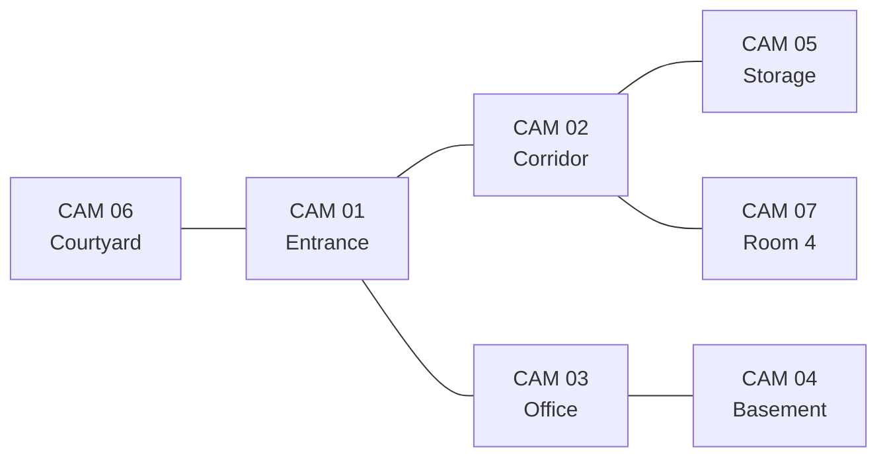

# Architektur

Das Gebäude ist ein altes, teilweise modernisiertes Verwaltungs- oder
Industriegebäude in Nachtschicht. Es wirkt funktional, glaubwürdig und leicht
vernachlässigt, aber nicht verlassen.

## Architekturregeln

- Räume müssen nach demselben Baukörper aussehen.
- Die Materialpalette bleibt über alle Kameras hinweg stabil.
- Renovierungsspuren sind erlaubt, solange sie nicht nach einem späteren
  Fantasy- oder Horror-Set aussehen.
- Sichtachsen, Türen und Lichtquellen dürfen sich verschieben, aber nicht
  völlig fremd werden.

## Wiederkehrende Elemente

- gealterter Putz
- graugrüne Wandflächen
- abgenutztes Linoleum oder Betonboden
- einfache Leuchtstoffröhren
- institutionelle Türen
- standardisierte Beschläge
- Kabelkanäle
- Rohre
- utilitäre Beschilderung
- funktionale Möbel

## Räumliches Modell

Das Diagramm ist ein Kontinuitätsmodell, kein exakter Grundriss. Entscheidend
ist, dass die Räume sich visuell logisch aus einem Gebäude ableiten lassen.

## Raumcharakter nach Bereichen

- **Eingang**: am klarsten lesbar, erste Referenz für Materialien und Licht.
- **Korridor**: Geometrie, Wiederholung, Zählbarkeit von Türen.
- **Büro**: kleine Objekte und minimale Verschiebungen.
- **Keller**: Feuchtigkeit, Metall, Rohre und schwere Türen.
- **Lager**: Regale, Verdeckung und enge Sichtachsen.
- **Innenhof**: natürliche Erklärungen durch Regen, Bewegung und Reflexion.
- **Room 4**: plausibel, sauberer, zu ordentlich und trotzdem noch Teil des
  gleichen Baukörpers.
