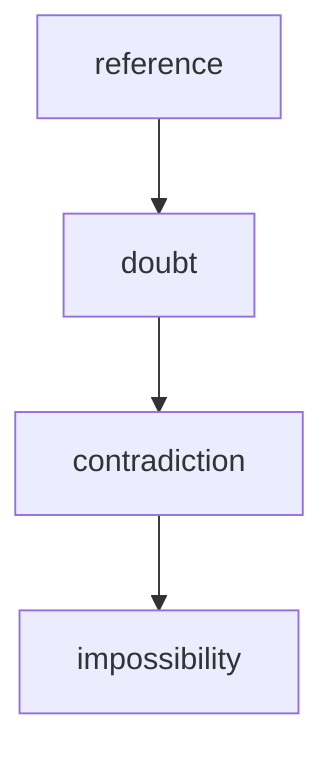

# Events und Zustände

## Standardisierte Zustände

- `normal`
- `movement`
- `distortion`
- `unknown`
- `lost`

Diese Zustände beschreiben, wie das Bild gelesen werden soll. Die Kamera
bleibt dabei grundsätzlich dieselbe Kamera.

## Eskalationsmodell

- **reference**: klare Referenz, alles wirkt logisch
- **doubt**: kleine Verschiebungen, die noch erklärbar scheinen
- **contradiction**: der Spieler erkennt einen echten Widerspruch
- **impossibility**: eine etablierte Regel wird gebrochen

## Anomalie-Regeln

- Level 1 darf irritieren, aber nicht sofort die Welt zerstören.
- Level 2 muss mit der mentalen Karte des Spielers kollidieren.
- Level 3 bleibt sparsam und wirkt am stärksten, wenn die Welt vorher
  glaubwürdig war.

## Zeit als visuelles Element

- Normalerweise laufen die Zeitstempel vorwärts und stabil.
- Bei Anomalien können einzelne Zeiten springen, wiederholen oder rückwärts
  erscheinen.
- Der Zeitstempel ist selbst eine unzuverlässige Informationsquelle.

## Bildwechsel

- Nach Möglichkeit bleibt die Kameraposition stabil.
- Bei Ereignissen werden nur die relevanten Elemente geändert.
- Große Architekturänderungen sind nur für die stärksten Regelbrüche erlaubt.
- Wenn ein Zustand `lost` ist, darf das Bild fast schwarz werden, muss aber
  noch Restdetails oder Rauschen enthalten.

## Mapping für die Bildsprache

- `normal` = ruhige Referenz
- `movement` = minimale, schwer greifbare Bewegung
- `distortion` = Interferenz, Rücksprung, Unschärfe oder Bildfehler
- `unknown` = zusätzliche, unlogische oder nicht passende Struktur
- `lost` = Signalverlust mit Restrauschen oder Dunkelheit
